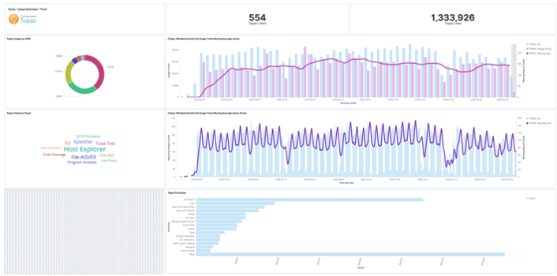
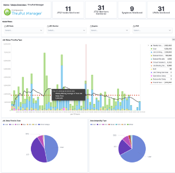
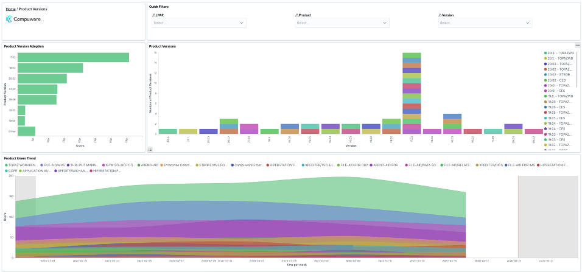
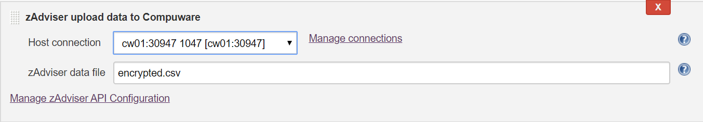

 

\

+-----------------------------------------------------------------------+
|     {jenkins-plugin-info:compuware-zadviser-api}                      |
+-----------------------------------------------------------------------+

{.confluence-embedded-image height="96"} {#section .auto-cursor-target}
=================================================================================================================================================================================

[Overview]{style="color: rgb(0,0,0);"} {#overview .auto-cursor-target}
======================================

zAdviser uses machine learning to find correlations between developer
behaviors and key performance indicators (KPIs) based on DevOps data and
Compuware product usage data. zAdviser captures a broad range of metrics
to help teams improve quality, velocity and efficiency---including usage
of specific Compuware tools and tool functions, source code management
(SCM) KPIs and diverse DevOps performance parameters across teams,
individual users and applications. Teams can use this intelligence to
pinpoint trends and patterns that may be helping or hindering their
mainframe software delivery. The plugin allows Jenkins users to collect
and download zAdviser data from Compuware with option to encrypt
personal information and finally upload to Compuware for further
processing.

See your data in zAdviser's highly intuitive and interactive dashboards
built on Elastic's Elastic Cloud service and Kibana. You'll get instant
visibility into features and functions usage, software development and
delivery processes, developer productivity and code-level information to
help teams make evidence-based decisions that improve development and
business outcomes.

{.confluence-embedded-image
height="250"} {.confluence-embedded-image
.confluence-thumbnail
height="250"} {.confluence-embedded-image
height="250"}

[Legal Notice]{style="color: rgb(0,0,0);"}
==========================================

By using a Compuware Plug-in, you are entering into an agreement with
Compuware Corporation as follows:  (a) Compuware grants you a
non-exclusive, non-transferable, non-sublicensable, revocable license to
use and display the Plug-ins on your zAdvisor Application solely for
your own internal business use.  Your use of this Compuware Plug-in is
subject to any and all software license and maintenance obligations to
which Compuware and your, or your employer, have entered into in writing
("Agreements").  This Compuware Plug-in is subject to all restrictions
on use set forth in such Agreements.  Subject to the Agreements, this
Plug-in and Plug-in Content may not be copied, modified, deleted,
reproduced, republished, posted, transmitted, sold, offered for sale, or
redistributed without Compuware's prior written permission.  You
acknowledge and agree that Compuware may monitor the zAdvisor
Application for compliance with the Agreement and these terms and
conditions; (b) THE COMPUWARE PLUG-IN IS PROVIDED ON AN "AS IS" AND "AS
AVAILABLE" BASIS.  COMPUWARE DISCLAIMS ANY WARRANTIES, EXPRESS, IMPLIED
OR STATUTORY, REGARDING ANY PLUG-IN, INCLUDING WARRANTIES OF ACCURACY,
MERCHANTABILITY, FITNESS FOR A PARTICULAR PURPOSE, OR NON-INFRINGEMENT. 
COMPUWARE FURTHER DISCLAIMS ANY WARRANTIES REGARDING THE SECURITY,
RELIABILITY, AVAILABILITY OR PERFORMANCE OF THE COMPUWARE PLUG-IN.  YOU
WILL BE SOLELY RESPONSIBLE FOR ANY DAMAGES TO ANY COMPUTER SYSTEM OR ANY
LOSS OR DATA OR INACCURATE DATA THAT RESULTS FROM THE USE OF THE
PLUG-INS.  COMPUWARE EXPRESSLY URGES ALL USERS OF THIS PLUG-IN TO
UTILIZE THE AVAILABLE AUDIT FEATURES TO ENSURE THAT ALL DATA IS ANALYZED
IN THE PLUG-IN (INCLUDING ANY PERSONAL OR IDENTIFIABLE DATA) PRIOR TO
SENDING SUCH DATA TO COMPUWARE.  If you do not agree with the terms of
this Plug-In, or to any changes, modifications or supplements to these
terms tat Compuware may implement in the future, you may terminate your
use of the Plug-Ins.  In that case, you agree to promptly remove the
Plug-ins from the zAdvisor Application and cease all further use of the
Plug-Ins.

[Prerequisites]{style="color: rgb(0,0,0);"}
===========================================

The following are required to use this plugin:

-   Topaz Workbench CLI version 20.02.01 or later. Refer to the [Topaz
    Workbench Install
    Guide](https://docs.compuware.com/kb/KB2001/PDF/TopazWorkbench_Install.pdf) for
    instructions.
-   Host Communications Interface
-   Customer Id
-   zAdviser Access Key

"){.emoticon
.emoticon-information} To obtain your Customer Id and zAdviser Access
Key please create a new case on
[support.compuware.com](http://support.compuware.com/) requesting a new
zAdviser Jenkins Plugin Access Token

[Installing in a Jenkins Instance]{style="color: rgb(0,0,0);"}
==============================================================

1.  Install the Compuware zAdviser API plugin according to the Jenkins
    instructions for installing plugins. Dependent plugins will
    automatically be installed.
2.  Install the Topaz Workbench CLI on the Jenkins instances that will
    execute the plugin. The Topaz Workbench CLI is available in the
    Topaz Workbench installation package. If you do not have the
    installation package, please visit
    [support.compuware.com](https://support.compuware.com/). For Topaz
    Workbench CLI installation instructions, please refer to the [Topaz
    Workbench Install
    Guide](https://docs.compuware.com/kb/KB2001/PDF/TopazWorkbench_Install.pdf).

[Configuring for Topaz Workbench CLI & Host Connections]{style="color: rgb(0,0,0);"}
====================================================================================

In order to access zAdviser data you will need to point to an installed
Topaz Workbench Command Line Interface (CLI). The Topaz Workbench CLI
will work with host connection(s) you also need to configure to download
zAdviser data, encrypt the data, and upload to Compuware where the data
will be hosted in Kibana.

[Navigate to Manage Jenkins / Configure System and go to Compuware
Configurations section.]{style="color: rgb(74,85,104);"}

-   **Windows Topaz Workbench CLI home** : Point to the Windows
    installation location of the CLI. If necessary, change the default
    values given to match the correct installation location.

-   **Linux Topaz Workbench CLI home** : Point to the Linux installation
    location of the CLI. If necessary, change the default values given
    to match the correct installation location.

**"){.emoticon
.emoticon-information} **The Topaz Workbench CLI must be installed on
the machine that is configured to run the job.

**Host connections**

"){.emoticon
.emoticon-information} If no host connection appears in the Host
Connections section, click Add Host Connection.

-   **Description** : Enter a description of the connection.

-   **Host:port** : Enter the z/OS host to connect to.

-   **Encryption protocol** : Select the desired encryption protocol to
    be used for this connection. The encryption protocol is used to
    encrypt data sent to and from the host. The default is \'None\'.

-   **Code page** : Select the desired code page to be used for this
    connection. The code page is used to translate data sent to and from
    the host. The default is 1047.

-   **Read/write timeout (minutes)** : Enter the number of minutes for
    the plugin to wait for a response from the host before timing out.

-   **CES URL** : [ Optionally, enter a URL for Compuware Enterprise
    Services (CES). This URL is used by other Compuware plugins that
    leverage REST APIs hosted by CES, for example Compuware's
    ISPW.]{style="color: rgb(51,51,51);"}

[{.confluence-embedded-image height="400"}]{style="color: rgb(0,0,0);"}
===================================================================================================================================================================================================================

[zAdviser API Configuration]{style="color: rgb(0,0,0);"}
========================================================

[In order to download zAdviser data, encrypt and upload to Compuware for
hosting in Kibana, a customer access key and id must be provided. An
encryption key is also required if encrypting data prior to
upload.]{style="color: rgb(0,0,0);"}

[[Navigate to Manage Jenkins / Configure System and go to zAdviser API
Configuration
section.]{style="color: rgb(74,85,104);"}]{style="color: rgb(0,0,0);"}

-   **Access key** : E[nter the zAdviser services access key provided by
    Compuware]{style="color: rgb(51,51,51);"}.
-   **Customer ID** : Enter your customer ID.
-   **Encryption key** : E[nter an encryption key used to encrypt the
    zAdviser data that is uploaded to
    Compuware.]{style="color: rgb(51,51,51);"}
-   [**Days in the past to start collecting data** : Enter the number of
    days in the past to start collecting zAdviser
    data.]{style="color: rgb(51,51,51);"}

[{.confluence-embedded-image height="250"}]{style="color: rgb(0,0,0);"}
===================================================================================================================================================================================================================

[Build Actions]{style="color: rgb(0,0,0);"}
===========================================

[[The following build actions are available. These actions can be
executed separately or combined
sequentially.]{style="color: rgb(74,85,104);"}]{style="color: rgb(0,0,0);"}

[[From a Freestyle Project navigate to Configure and go to Build
section, click Add build step and select from the build actions
below.]{style="color: rgb(74,85,104);"}]{style="color: rgb(0,0,0);"}

[Download zAdviser data and optionally upload to Compuware]{style="color: rgb(0,0,0);"}
---------------------------------------------------------------------------------------

[This integration allows downloading of zAdviser data from a specific
host with option to encrypt the data before optionally uploading to
Compuware for hosting in Kibana.]{style="color: rgb(0,0,0);"}

1.  On the **Configuration **page of the job or project, in
    the **Build **section, from the **Add build step** list, select
    **zAdviser download data and optionally upload to Compuware**.

[[This build action has following
parameters:]{style="color: rgb(74,85,104);"}]{style="color: rgb(0,0,0);"}

-   **Host connection** : Select the host connection to be used to
    connect to the z/OS host.

"){.emoticon
.emoticon-information} Alternatively, to add a connection,
click **Manage connections**. The **Host connections** section of the
Jenkins configuration page appears so a connection can be added.

-   **Login credentials** : Select the stored credentials to use for
    logging onto the z/OS host.

"){.emoticon
.emoticon-information} Alternatively, click **Add **to add credentials
using the Credentials Plugin. Refer to the Jenkins documentation for the
Credentials Plugin.

-   **JCL** : U[pdate the JCL as appropriate for your
    organization:]{style="letter-spacing: 0.0px;"}

    -   If using IFASMFDL specify a logstream name
    -   If using IFASMFDP specify an input dataset
    -   DATE parameter is overridden by Jenkins parameter {zzzz} if it
        is specified.
    -   TYPE must specify the Compuware zAdviser SMF record type, per
        the SMF\_ID parameter
    -   The OUTDD parameter must be a temporary dataset that is passed
        to the ROICOPY step.
    -   The //CSVOUT DD DCB attributes must not be changed.
    -   If your ECC libraries are not in the LNKLIST, specify the
        SLCXLOAD and SLCXAUTH libraries on the //STEPLIB.

-   [**Unencrypted zAdviser data file** : Enter the file path to where
    unencrypted zAdviser data will be
    written.]{style="color: rgb(51,51,51);"}

-   [**Encrypt zAdviser data** : Select to input a key to encrypt
    downloaded zAdviser data before it is uploaded to
    Compuware.]{style="color: rgb(51,51,51);"}

-   [**Encrypted zAdviser data file** : Enter the file path to where
    encrypted zAdviser data will be
    written.]{style="color: rgb(51,51,51);"}

-   [**Upload zAdviser data to Compuware** : Select to have zAdviser
    data automatically uploaded to
    Compuware.]{style="color: rgb(51,51,51);"}
    -   When not checked, the zAdviser data upload will need to be done
        in a separate build step.

    -   If the option to encrypt zAdviser data is checked, only
        encrypted zAdviser data is sent to Compuware (unencrypted data
        will not be sent).

["){.emoticon
.emoticon-information} Click **Manage zAdviser API Configuration** to
update any zAdviser API configuration
items.]{style="color: rgb(51,51,51);"}

[{.confluence-embedded-image height="400"}]{style="color: rgb(0,0,0);"}
---------------------------------------------------------------------------------------------------------------------------------------------------------------------------------------------------------------------

#### Download zAdviser data and optionally upload to Compuware (Pipeline Script)

[node {]{style="color: rgb(0,0,0);"}

[zAdviserDownload connectionId:
\'0274970b-bade-48c1-b726-a95b84c4abbb\', ]{style="color: rgb(0,0,0);"}

[credentialsId: \'e09e4c7a-76c5-4038-add7-b41a882640f5\',
]{style="color: rgb(0,0,0);"}

[encryptData: true, ]{style="color: rgb(0,0,0);"}

[encryptedDataFile: \'encrypted.csv\', ]{style="color: rgb(0,0,0);"}

[jcl: \'\'\'//ZADVISER JOB (\\\'EXTRACT\\\',4WOODWARD), // \\\'CPWR\\\',
// CLASS=A, // MSGCLASS=X, // REGION=0M, // NOTIFY=&SYSUID //\* //\* DO
NOT TOUCH THE DATE FIELD(S) BELOW AS THEY WILL BE OVERRIDDEN WHEN JCL IS
PROCESSED //\* //\* DUMP ZADVISER SMF RECORDS (NON-LOGSTREAM) //\*
//STEP1 EXEC PGM=IFASMFDP //SMFIN DD DISP=SHR,DSN=MIS.SMF.CW01.DAILY
//OUTDD1 DD DISP=(,PASS),DSN=&&SMFOUT, //
UNIT=VIO,SPACE=(CYL,(3000,3000),RLSE), //
DCB=(RECFM=VBS,LRECL=32760,BLKSIZE=4096) //SYSPRINT DD SYSOUT=\* //SYSIN
DD \* INDD(SMFIN,OPTIONS(DUMP)) DATE(START,END) OUTDD(OUTDD1,TYPE(241))
//\* //\* CONVERT TO .CSV //\* //STEP2 EXEC PGM=ROICOPY //STEPLIB DD
DISP=SHR,DSN=CPWR.SLCXLOAD // DD DISP=SHR,DSN=CPWR.SLCXAUTH //ROIIN DD
DISP=(MOD,PASS),DSN=&&SMFOUT //SYSUDUMP DD DUMMY //CSVOUT DD
DSN=CSV.OUTPUT.DATASET, // DISP=(NEW,CATLG,DELETE), //
EATTR=OPT,VOL=SER=PRD900,DSNTYPE=LARGE, //
UNIT=SYSDA,SPACE=(CYL,(2500,2500),RLSE), //
DCB=(DSORG=PS,LRECL=1184,RECFM=U,BLKSIZE=32760)\'\'\' ,
unencryptedDataFile: \'unencrypted.csv\']{style="color: rgb(0,0,0);"}

[}]{style="color: rgb(0,0,0);"}

[Upload zAdviser data to Compuware]{style="color: rgb(0,0,0);"}
---------------------------------------------------------------

[This integration allows uploading of zAdviser data for a specific host
to Compuware for hosting in Kibana.]{style="color: rgb(0,0,0);"}

["){.emoticon
.emoticon-information} This build step should be paired with a
**zAdviser download data and optionally upload to Compuware **build step
having the same host.]{style="color: rgb(0,0,0);"}

1.  On the **Configuration **page of the job or project, in
    the **Build **section, from the **Add build step** list, select
    **zAdviser upload to Compuware**.

[[This build action has following
parameters:]{style="color: rgb(74,85,104);"}]{style="color: rgb(0,0,0);"}

-   **Host connection** : Select the host connection from the **zAdviser
    download data and optionally upload to Compuware** build step.

"){.emoticon
.emoticon-information} To manage connections, click **Manage
connections**. The **Host connections** section of the Jenkins
configuration page appears allowing adding, updating, and deleting of
connections.

-   **[zAdviser data file]{style="color: rgb(51,51,51);"}**[ : Enter the
    file path to where unencrypted zAdviser data will be
    written.]{style="color: rgb(51,51,51);"}

["){.emoticon
.emoticon-information} Click **Manage zAdviser API Configuration** to
update any zAdviser API configuration
items.]{style="color: rgb(51,51,51);"}

[{.confluence-embedded-image height="150"}]{style="color: rgb(0,0,0);"}
=====================================================================================================================================================================================================================

#### zAdviser upload to Compuware (Pipeline Script)

[node {]{style="color: rgb(0,0,0);"}

zAdviserUpload connectionId: \'0274970b-bade-48c1-b726-a95b84c4abbb\',
uploadDataFile: \'encrypted.csv\'

[}]{style="color: rgb(0,0,0);"}

[Using Pipeline Syntax to Generate Pipeline Script]{style="color: rgb(0,0,0);"}
===============================================================================

-   Do one of the following:

    -   When working with an existing Pipeline job, click the **Pipeline
        Syntax** link in the left panel. The **Snippet
        Generator** appears.

    -   When configuring a Pipeline job, click the **Pipeline
        Syntax** link at the bottom of the **Pipeline **configuration
        section. The **Snippet Generator** appears.

-   **Sample Step** : S[elect one of the zAdviser build actions from
    above.]{style="letter-spacing: 0.0px;"}

-   [Complete the displayed fields.]{style="letter-spacing: 0.0px;"}

-   Click **Generate Pipeline Script**. The Groovy script to invoke the
    step appears. The script can be added to the Pipeline section when
    configuring a Pipeline job. A sample script is shown below:

    {.confluence-embedded-image
    height="400"}

[Known Limitations]{style="color: rgb(0,0,0);"}
===============================================

-   The browser default header size may not be suitable when submitting
    large free-form JCL. This can be remedied by modifying the
    jenkins.xml file located at the root of where your Jenkins is
    installed. Update the jenkins.xml arguments as follows:
    -   Modify the Jenkins service arguments, but adding, or changing if
        already present, argument: **requestHeaderSize**; a sample of
        the arguments is shown below:

        +-----------------------------------------------------------------------+
        |      <arguments>-Xrs -Xmx256m -Dhudson.lifecycle=hudson               |
        | .lifecycle.WindowsServiceLifecycle -jar "%BASE%\jenkins.war" --httpPo |
        | rt=8080 --webroot="%BASE%\war" --requestHeaderSize=128000</arguments> |
        +-----------------------------------------------------------------------+

        \

[Product Assistance]{style="color: rgb(0,0,0);"}
================================================

Compuware provides assistance for customers with its documentation, the
Compuware Support Center web site, and telephone customer support.

[Compuware Support Center]{style="color: rgb(0,0,0);"}
------------------------------------------------------

You can access online information for Compuware products via our Support
Center site at
[https://support.compuware.com](https://support.compuware.com/). Support
Center provides access to critical information about your Compuware
products. You can review frequently asked questions, read or download
documentation, access product fixes, or e-mail your questions or
comments. The first time you access Support Center, you must register
and obtain a password. Registration is free.

[Contacting Customer Support]{style="color: rgb(0,0,0);"}
---------------------------------------------------------

At Compuware, we strive to make our products and documentation the best
in the industry. Feedback from our customers helps us maintain our
quality standards. If you need support services, please obtain the
following information before calling Compuware\'s 24-hour telephone
support:

-   The name, release number, and build number of your product. This
    information is displayed in the **About **dialog box.

-   Installation information including installed options, whether the
    product uses local or network databases, whether it is installed in
    the default directories, whether it is a standalone or network
    installation, and whether it is a client or server installation.

-   Environment information, such as the operating system and release on
    which the product is installed, memory, hardware and network
    specification, and the names and releases of other applications that
    were running when the problem occurred.

-   The location of the problem within the running application and the
    user actions taken before the problem occurred.

-   The exact application, licensing, or operating system error
    messages, if any.

You can contact Compuware in one of the following ways:

#### [Phone]{style="color: rgb(0,0,0);"}

-   USA and Canada: 1-800-538-7822 or 1-313-227-5444.

-   All other countries: Contact your local Compuware office. Contact
    information is available
    at [https://support.compuware.com](https://support.compuware.com/).

#### [Web]{style="color: rgb(0,0,0);"}

You can report issues via Compuware Support
Center: [https://support.compuware.com](https://support.compuware.com/).

Note: Please report all high-priority issues by phone.

[Corporate Web Site]{style="color: rgb(0,0,0);"}
------------------------------------------------

To access Compuware\'s site on the Web, go
to [https://www.compuware.com](https://www.compuware.com/). The
Compuware site provides a variety of product and support information.

Change Log
==========

[See ]{style="color: rgb(74,85,104);"}[https://github.com/jenkinsci/compuware-zadviser-api-plugin/releases](https://github.com/jenkinsci/cloudbees-jenkins-advisor-plugin/releases)

\

 
